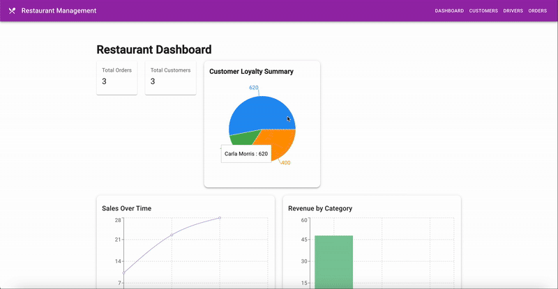

# Restaurant Order Management App
A full-stack web application that manages a restaurant’s menu, customer orders, deliveries, and sales analytics — complete with a Material UI dashboard and interactive charts.

This project demonstrates a complete restaurant management system with:

- Normalized PostgreSQL database (menu, customers, orders, deliveries)
- Express + Node.js backend with RESTful API endpoints
- React + Vite frontend built with Material UI and Recharts
- Dynamic analytics dashboard using PostgreSQL views and stored procedures

**A gif of your finished product in action:**
<br />

**The exercise you chose and why:**
I used to work in a restaurant, and this project spoke to me!

**A short explanation of what you built:**
I build a Restaurant Management dashboard using Vite, React, Material, and Recharts.  

**Feedback notes:**
It was frustrating getting the right data from the postgress, working with complex queries and views.

**What you would add/change if you had more time:**
I would add more charts on the dashboard, like Total Revenue, Delivery Performance. As well as polish the code, and add CRUD fuctionality to orders and delivery. Add tests.

### External libraries used:

#### Frontend:
| Library                           | Purpose                                    |
| --------------------------------- | ------------------------------------------ |
| [React](https://react.dev/)       | Component-based frontend UI                |
| [Vite](https://vitejs.dev/)       | Fast local development + HMR               |
| [Material UI](https://mui.com/)   | Layout, tables, modals, and styling        |
| [Recharts](https://recharts.org/) | Data visualization (pie, bar, line charts) |
| [Axios](https://axios-http.com/)  | REST API calls                             |

#### Backend:
| Library                                          | Purpose                                  |
| ------------------------------------------------ | ---------------------------------------- |
| [Express](https://expressjs.com/)                | RESTful API framework                    |
| [pg](https://node-postgres.com/)                 | PostgreSQL connection and query handling |
| [dotenv](https://www.npmjs.com/package/dotenv)   | Environment variable management          |
| [nodemon](https://www.npmjs.com/package/nodemon) | Live reload during development           |


## Tech stack:
- Backend: Node.js (Express) + PostgreSQL
- Frontend: React (Vite)
- Database: PostgreSQL 14+

## Local Setup Instructions
### Step 1 — Clone open repo
```bash
git clone https://github.com/alexcheva/restaurant-order-management.git
cd restaurant-order-management
```
### Step 2 —  Database Setup

To recreate the database locally:

```bash
createdb restaurant_db
```

Import the schema and sample data:

```bash
psql -U <your_username> -d restaurant_db -f db/restaurant_db_dump.sql
```
Confirm setup:

```bash
psql -d restaurant_db -c "\dt"
```
IMPORTANT: create views:
Paste `db/views.sql` in postgress to recreate the views.
```bash
psql -U <your_username> -d restaurant_db -f db/views.sql
```

### Step 3 - Backend setup
```bash
cd server
npm install
```
#### Create your `server/.env` file:
```
PORT=4000
DATABASE_URL=postgresql://YOUR_USERNAME@localhost:5432/restaurant_db
```
<!-- Now visit http://localhost:4000/api/orders to confirm data loads as JSON. -->
### Run backend:
```bash
npm run dev
```
### Step 4 - Frontend setup
```bash
cd client
npm install
```
<!-- #### Create your `client/.env` file:
```
REACT_APP_API_URL=http://localhost:4000
``` -->

### Run Frontend:
```bash
npm run dev
```
